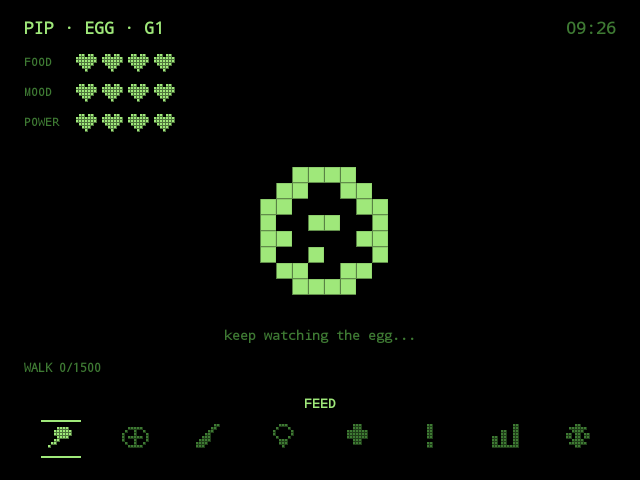

# Tapogotchi

Tapogotchi is a virtual pet for the RayNeo X3 Pro AR glasses that lives in the wearer's view and runs on real time: hours pass on the wall clock whether or not the glasses are on, and each new session opens with a "While you were away" report simulating everything that happened in the interim. Because the pet rides on your face rather than in your pocket, it can react to the wearer's actual movement — step detection during a walk feeds a daily walk goal that affects its mood and care score — and it drifts within the field of view in response to head turns, so it reads as a creature sharing the room rather than a static overlay. Care needs (hunger, mood, energy, sickness, discipline) are communicated through a distinct chirp for each state rather than constant on-screen prompts, so the pet can be tended by ear. It grows through the classic egg-to-elder life stages, with the adult form and, eventually, a gravestone and lineage record for the next generation, reflecting the quality of care it received.

## Screenshot

  

## Controls (temple pads)

| Gesture | Action |
|---|---|
| RIGHT swipe ⇄ | move along the icon bar / choose / guess in the dance-off |
| RIGHT swipe ⇅ | settings rows |
| RIGHT tap | select / activate |
| RIGHT double-tap | back (and: forfeit a dance-off) |

Icon bar: FEED (meal or snack) · PLAY (dance-off, guess the hop) · CLEAN · LIGHTS · MEDICINE · SCOLD · STATS · SETTINGS.

## Download

[Tapogotchi.apk](Tapogotchi.apk)
